<!--
  Generated by dbterd from atlas-data-repo/dbt/ artifacts.
  DO NOT EDIT BY HAND. Regenerate via atlas-data-repo/dbt/regenerate-erd.sh
  Last regenerated: 2026-04-23T20:30Z
-->

# Atlas marts ERD

Entity-relationship view of the `marts.*` schema. Edges are derived
from `relationships:` data tests in the per-model `schema.yml` files.
See [naming-conventions.md](naming-conventions.md) for the canonical
vocabulary and [the dbt README](../../atlas-data-repo/dbt/README.md)
for how to regenerate this file.

```mermaid
erDiagram
  "MODEL.ATLAS.CROSSWALK_KOMMUNE_NAME" {
    text name
    text name_kind
    text kommune_nr
  }
  "MODEL.ATLAS.DIM_ACTIVITY" {
    text activity_id
    text ngo_orgnr
    text canonical_name
    text service_category_code
    boolean is_active
  }
  "MODEL.ATLAS.DIM_CHAPTER" {
    text chapter_id
    text ngo_orgnr
    text chapter_level
    text parent_chapter_id
    text chapter_orgnr
    text name
    text kommune_nr
    boolean is_active
    text postal_address_line1
    text postal_code
    text post_office
    text phone
    text email
    text web
    timestamp-with-time-zone updated_at
  }
  "MODEL.ATLAS.DIM_FYLKE" {
    text fylke_nr
    text fylke_name
    text fylke_name_alt
    text notes
    timestamp-with-time-zone updated_at
    date valid_from
    date valid_to
    boolean is_active
  }
  "MODEL.ATLAS.DIM_KOMMUNE" {
    text kommune_nr
    text kommune_name
    text kommune_name_alt
    text fylke_nr
    text notes
    timestamp-with-time-zone updated_at
    date valid_from
    date valid_to
    boolean is_active
    unknown kommune_name_sami
  }
  "MODEL.ATLAS.FACT_CHAPTER_ACTIVITIES" {
    text chapter_id
    text activity_id
    text ngo_orgnr
    text kommune_nr
    text local_activity_name
    boolean is_active
    text canonical_name
    text source_id
    timestamp-with-time-zone updated_at
  }
  "MODEL.ATLAS.FACT_KOMMUNE_INDICATORS" {
    text source_id
    text kommune_nr
    text kommune_name
    text fylke_nr
    text fylke_name
    integer year
    text contents_code
    text contents_label
    numeric value
    text status
    boolean kommune_is_active
    timestamp-with-time-zone updated_at
  }
  "MODEL.ATLAS.INDICATORS__FHI_BOR_ALENE" {
    text source_id
    text region_code
    text kommune_nr
    text fylke_nr
    integer year
    text period
    integer period_start_year
    integer period_end_year
    text age_group
    integer age_group_min
    integer age_group_max
    text contents_code
    text contents_label
    numeric value
    text status
    timestamp-with-time-zone updated_at
  }
  "MODEL.ATLAS.INDICATORS__FHI_MOBBING" {
    text source_id
    text region_code
    text kommune_nr
    text fylke_nr
    integer year
    text period
    integer period_start_year
    integer period_end_year
    text sex
    text grade
    text question_id
    text contents_code
    text contents_label
    numeric value
    text status
    timestamp-with-time-zone updated_at
  }
  "MODEL.ATLAS.INDICATORS__FHI_TRANGBODD" {
    text source_id
    text region_code
    text kommune_nr
    text fylke_nr
    integer year
    text period
    integer period_start_year
    integer period_end_year
    text age_group
    integer age_group_min
    integer age_group_max
    text parents_education
    text parents_education_label_no
    text housing_status
    text contents_code
    text contents_label
    numeric value
    text status
    timestamp-with-time-zone updated_at
  }
  "MODEL.ATLAS.INDICATORS__FHI_VGS_GJENNOMFORING" {
    text source_id
    text region_code
    text kommune_nr
    text fylke_nr
    integer year
    text period
    integer period_start_year
    integer period_end_year
    text sex
    text parents_education
    text parents_education_label_no
    text immigration_category
    text immigration_category_label_no
    text contents_code
    text contents_label
    numeric value
    text status
    timestamp-with-time-zone updated_at
  }
  "MODEL.ATLAS.INDICATORS__SSB_06083" {
    text source_id
    text region_code
    text kommune_nr
    text fylke_nr
    text family_type
    text family_type_label_no
    text family_type_label_en
    integer year
    text contents_code
    text contents_label
    numeric value
    text status
    timestamp-with-time-zone updated_at
  }
  "MODEL.ATLAS.INDICATORS__SSB_06913" {
    text source_id
    text region_code
    text kommune_nr
    text fylke_nr
    integer year
    text contents_code
    text contents_label
    numeric value
    text status
    timestamp-with-time-zone updated_at
  }
  "MODEL.ATLAS.INDICATORS__SSB_06944" {
    text source_id
    text region_code
    text kommune_nr
    text fylke_nr
    text household_type
    text household_type_label_no
    text household_type_label_en
    integer year
    text contents_code
    text contents_label
    numeric value
    text status
    timestamp-with-time-zone updated_at
  }
  "MODEL.ATLAS.INDICATORS__SSB_06947" {
    text source_id
    text region_code
    text kommune_nr
    text fylke_nr
    integer year
    text contents_code
    text contents_label
    numeric value
    text status
    timestamp-with-time-zone updated_at
  }
  "MODEL.ATLAS.INDICATORS__SSB_07459" {
    text source_id
    text region_code
    text kommune_nr
    text fylke_nr
    text sex
    text age
    integer age_int
    integer age_min
    integer year
    text contents_code
    text contents_label
    numeric value
    text status
    timestamp-with-time-zone updated_at
  }
  "MODEL.ATLAS.INDICATORS__SSB_08764" {
    text source_id
    text region_code
    text kommune_nr
    text fylke_nr
    integer year
    text contents_code
    text contents_label
    numeric value
    text status
    timestamp-with-time-zone updated_at
  }
  "MODEL.ATLAS.INDICATORS__SSB_09429" {
    text source_id
    text region_code
    text kommune_nr
    text fylke_nr
    text education_level
    text education_level_label_no
    text education_level_label_en
    text sex
    integer year
    text contents_code
    text contents_label
    numeric value
    text status
    timestamp-with-time-zone updated_at
  }
  "MODEL.ATLAS.INDICATORS__SSB_12063" {
    text source_id
    text region_code
    text kommune_nr
    text fylke_nr
    integer year
    text contents_code
    text contents_label
    numeric value
    text status
    timestamp-with-time-zone updated_at
  }
  "MODEL.ATLAS.INDICATORS__SSB_12131" {
    text source_id
    text region_code
    text kommune_nr
    text fylke_nr
    integer year
    text contents_code
    text contents_label
    numeric value
    text status
    timestamp-with-time-zone updated_at
  }
  "MODEL.ATLAS.INDICATORS__SSB_12132" {
    text source_id
    text region_code
    text kommune_nr
    text fylke_nr
    integer year
    text contents_code
    text contents_label
    numeric value
    text status
    timestamp-with-time-zone updated_at
  }
  "MODEL.ATLAS.INDICATORS__SSB_12292" {
    text source_id
    text region_code
    text kommune_nr
    text fylke_nr
    integer year
    text contents_code
    text contents_label
    numeric value
    text status
    timestamp-with-time-zone updated_at
  }
  "MODEL.ATLAS.INDICATORS__SSB_12944" {
    text region_code
    text source_id
    text kommune_nr
    text fylke_nr
    text age_group
    integer age_group_min
    integer age_group_max
    text period
    integer period_start_year
    integer period_end_year
    text contents_code
    text contents_label
    numeric value
    text status
    timestamp-with-time-zone updated_at
  }
  "MODEL.ATLAS.INDICATORS__SSB_13995" {
    text source_id
    text region_code
    text kommune_nr
    text fylke_nr
    integer year
    text contents_code
    text contents_label
    numeric value
    text status
    timestamp-with-time-zone updated_at
  }
  "MODEL.ATLAS.SUPPLY__REDCROSS_BRANCH_ACTIVITIES" {
    text chapter_id
    text ngo_orgnr
    text canonical_name
    text local_activity_name
    text service_category_code
    boolean is_service
    timestamp-with-time-zone updated_at
  }
  "MODEL.ATLAS.SUPPLY__REDCROSS_BRANCHES" {
    text chapter_id
    text ngo_orgnr
    text chapter_level
    text parent_chapter_id
    text chapter_orgnr
    text name
    text kommune_nr
    boolean is_active
    text postal_address_line1
    text postal_code
    text post_office
    text phone
    text email
    text web
    timestamp-with-time-zone updated_at
  }
  "SEED.ATLAS.DIM_NGO" {
    text orgnr
    text slug
    text name
    text brand_name
    text website_url
    text tier
    text chapter_data_shape
    boolean has_chapters
    text primary_focus
    text icnpo_code_1
    text icnpo_code_2
    text icnpo_code_3
  }
  "SEED.ATLAS.DIM_POSTNUMMER" {
    text postnummer
    text post_office
    text kommune_nr
    integer sort_order
  }
  "SEED.ATLAS.REF_ATLAS_SERVICE_CATEGORY" {
    text code
    text label_no
    text label_en
    text description
    integer sort_order
  }
  "SEED.ATLAS.REF_BRREG_ICNPO" {
    text code
    text parent_code
    text label_no
    text label_en
    integer sort_order
  }
  "SEED.ATLAS.REF_FHI_INNVKAT" {
    text code
    text label_no
    text label_en
    integer sort_order
  }
  "SEED.ATLAS.REF_FHI_UTDANN" {
    text code
    text label_no
    text label_en
    integer sort_order
  }
  "SEED.ATLAS.REF_SSB_FAMILY_TYPE" {
    text code
    text label_no
    text label_en
    integer sort_order
  }
  "SEED.ATLAS.REF_SSB_HOUSEHOLD_TYPE" {
    text code
    text label_no
    text label_en
    integer sort_order
  }
  "SEED.ATLAS.REF_SSB_NIVAA" {
    text code
    text label_no
    text label_en
    integer sort_order
  }
  "SEED.ATLAS.REF_UN_SDG" {
    text code
    text label_no
    text label_en
    integer sort_order
  }
  "MODEL.ATLAS.CROSSWALK_KOMMUNE_NAME" }|--|| "MODEL.ATLAS.DIM_KOMMUNE": kommune_nr
  "MODEL.ATLAS.DIM_ACTIVITY" }|--|| "SEED.ATLAS.DIM_NGO": orgnr--ngo_orgnr
  "MODEL.ATLAS.DIM_ACTIVITY" }|--|| "SEED.ATLAS.REF_ATLAS_SERVICE_CATEGORY": code--service_category_code
  "MODEL.ATLAS.DIM_CHAPTER" }|--|| "MODEL.ATLAS.DIM_KOMMUNE": kommune_nr
  "MODEL.ATLAS.DIM_CHAPTER" }|--|| "SEED.ATLAS.DIM_NGO": orgnr--ngo_orgnr
  "MODEL.ATLAS.DIM_CHAPTER" }|--|| "MODEL.ATLAS.DIM_CHAPTER": chapter_id--parent_chapter_id
  "SEED.ATLAS.DIM_NGO" }|--|| "SEED.ATLAS.REF_BRREG_ICNPO": code--icnpo_code_1
  "SEED.ATLAS.DIM_NGO" }|--|| "SEED.ATLAS.REF_BRREG_ICNPO": code--icnpo_code_2
  "SEED.ATLAS.DIM_NGO" }|--|| "SEED.ATLAS.REF_BRREG_ICNPO": code--icnpo_code_3
  "SEED.ATLAS.DIM_POSTNUMMER" }|--|| "MODEL.ATLAS.DIM_KOMMUNE": kommune_nr
  "MODEL.ATLAS.FACT_CHAPTER_ACTIVITIES" }|--|| "MODEL.ATLAS.DIM_ACTIVITY": activity_id
  "MODEL.ATLAS.FACT_CHAPTER_ACTIVITIES" }|--|| "MODEL.ATLAS.DIM_CHAPTER": chapter_id
  "MODEL.ATLAS.FACT_CHAPTER_ACTIVITIES" }|--|| "MODEL.ATLAS.DIM_KOMMUNE": kommune_nr
  "MODEL.ATLAS.FACT_CHAPTER_ACTIVITIES" }|--|| "SEED.ATLAS.DIM_NGO": orgnr--ngo_orgnr
  "MODEL.ATLAS.FACT_KOMMUNE_INDICATORS" }|--|| "MODEL.ATLAS.DIM_FYLKE": fylke_nr
  "MODEL.ATLAS.FACT_KOMMUNE_INDICATORS" }|--|| "MODEL.ATLAS.DIM_KOMMUNE": kommune_nr
  "MODEL.ATLAS.INDICATORS__FHI_BOR_ALENE" }|--|| "MODEL.ATLAS.DIM_FYLKE": fylke_nr
  "MODEL.ATLAS.INDICATORS__FHI_BOR_ALENE" }|--|| "MODEL.ATLAS.DIM_KOMMUNE": kommune_nr
  "MODEL.ATLAS.INDICATORS__FHI_MOBBING" }|--|| "MODEL.ATLAS.DIM_FYLKE": fylke_nr
  "MODEL.ATLAS.INDICATORS__FHI_MOBBING" }|--|| "MODEL.ATLAS.DIM_KOMMUNE": kommune_nr
  "MODEL.ATLAS.INDICATORS__FHI_TRANGBODD" }|--|| "MODEL.ATLAS.DIM_FYLKE": fylke_nr
  "MODEL.ATLAS.INDICATORS__FHI_TRANGBODD" }|--|| "MODEL.ATLAS.DIM_KOMMUNE": kommune_nr
  "MODEL.ATLAS.INDICATORS__FHI_TRANGBODD" }|--|| "SEED.ATLAS.REF_FHI_UTDANN": code--parents_education
  "MODEL.ATLAS.INDICATORS__FHI_VGS_GJENNOMFORING" }|--|| "MODEL.ATLAS.DIM_FYLKE": fylke_nr
  "MODEL.ATLAS.INDICATORS__FHI_VGS_GJENNOMFORING" }|--|| "SEED.ATLAS.REF_FHI_INNVKAT": code--immigration_category
  "MODEL.ATLAS.INDICATORS__FHI_VGS_GJENNOMFORING" }|--|| "MODEL.ATLAS.DIM_KOMMUNE": kommune_nr
  "MODEL.ATLAS.INDICATORS__FHI_VGS_GJENNOMFORING" }|--|| "SEED.ATLAS.REF_FHI_UTDANN": code--parents_education
  "MODEL.ATLAS.INDICATORS__SSB_06083" }|--|| "SEED.ATLAS.REF_SSB_FAMILY_TYPE": code--family_type
  "MODEL.ATLAS.INDICATORS__SSB_06083" }|--|| "MODEL.ATLAS.DIM_FYLKE": fylke_nr
  "MODEL.ATLAS.INDICATORS__SSB_06083" }|--|| "MODEL.ATLAS.DIM_KOMMUNE": kommune_nr
  "MODEL.ATLAS.INDICATORS__SSB_06913" }|--|| "MODEL.ATLAS.DIM_FYLKE": fylke_nr
  "MODEL.ATLAS.INDICATORS__SSB_06913" }|--|| "MODEL.ATLAS.DIM_KOMMUNE": kommune_nr
  "MODEL.ATLAS.INDICATORS__SSB_06944" }|--|| "MODEL.ATLAS.DIM_FYLKE": fylke_nr
  "MODEL.ATLAS.INDICATORS__SSB_06944" }|--|| "SEED.ATLAS.REF_SSB_HOUSEHOLD_TYPE": code--household_type
  "MODEL.ATLAS.INDICATORS__SSB_06944" }|--|| "MODEL.ATLAS.DIM_KOMMUNE": kommune_nr
  "MODEL.ATLAS.INDICATORS__SSB_06947" }|--|| "MODEL.ATLAS.DIM_FYLKE": fylke_nr
  "MODEL.ATLAS.INDICATORS__SSB_06947" }|--|| "MODEL.ATLAS.DIM_KOMMUNE": kommune_nr
  "MODEL.ATLAS.INDICATORS__SSB_07459" }|--|| "MODEL.ATLAS.DIM_FYLKE": fylke_nr
  "MODEL.ATLAS.INDICATORS__SSB_07459" }|--|| "MODEL.ATLAS.DIM_KOMMUNE": kommune_nr
  "MODEL.ATLAS.INDICATORS__SSB_08764" }|--|| "MODEL.ATLAS.DIM_FYLKE": fylke_nr
  "MODEL.ATLAS.INDICATORS__SSB_08764" }|--|| "MODEL.ATLAS.DIM_KOMMUNE": kommune_nr
  "MODEL.ATLAS.INDICATORS__SSB_09429" }|--|| "SEED.ATLAS.REF_SSB_NIVAA": code--education_level
  "MODEL.ATLAS.INDICATORS__SSB_09429" }|--|| "MODEL.ATLAS.DIM_FYLKE": fylke_nr
  "MODEL.ATLAS.INDICATORS__SSB_09429" }|--|| "MODEL.ATLAS.DIM_KOMMUNE": kommune_nr
  "MODEL.ATLAS.INDICATORS__SSB_12063" }|--|| "MODEL.ATLAS.DIM_FYLKE": fylke_nr
  "MODEL.ATLAS.INDICATORS__SSB_12063" }|--|| "MODEL.ATLAS.DIM_KOMMUNE": kommune_nr
  "MODEL.ATLAS.INDICATORS__SSB_12131" }|--|| "MODEL.ATLAS.DIM_FYLKE": fylke_nr
  "MODEL.ATLAS.INDICATORS__SSB_12131" }|--|| "MODEL.ATLAS.DIM_KOMMUNE": kommune_nr
  "MODEL.ATLAS.INDICATORS__SSB_12132" }|--|| "MODEL.ATLAS.DIM_FYLKE": fylke_nr
  "MODEL.ATLAS.INDICATORS__SSB_12132" }|--|| "MODEL.ATLAS.DIM_KOMMUNE": kommune_nr
  "MODEL.ATLAS.INDICATORS__SSB_12292" }|--|| "MODEL.ATLAS.DIM_FYLKE": fylke_nr
  "MODEL.ATLAS.INDICATORS__SSB_12292" }|--|| "MODEL.ATLAS.DIM_KOMMUNE": kommune_nr
  "MODEL.ATLAS.INDICATORS__SSB_12944" }|--|| "MODEL.ATLAS.DIM_FYLKE": fylke_nr
  "MODEL.ATLAS.INDICATORS__SSB_12944" }|--|| "MODEL.ATLAS.DIM_KOMMUNE": kommune_nr
  "MODEL.ATLAS.INDICATORS__SSB_13995" }|--|| "MODEL.ATLAS.DIM_FYLKE": fylke_nr
  "MODEL.ATLAS.INDICATORS__SSB_13995" }|--|| "MODEL.ATLAS.DIM_KOMMUNE": kommune_nr
  "SEED.ATLAS.REF_BRREG_ICNPO" }|--|| "SEED.ATLAS.REF_BRREG_ICNPO": code--parent_code
  "MODEL.ATLAS.SUPPLY__REDCROSS_BRANCH_ACTIVITIES" }|--|| "MODEL.ATLAS.DIM_CHAPTER": chapter_id
  "MODEL.ATLAS.SUPPLY__REDCROSS_BRANCH_ACTIVITIES" }|--|| "SEED.ATLAS.DIM_NGO": orgnr--ngo_orgnr
  "MODEL.ATLAS.SUPPLY__REDCROSS_BRANCH_ACTIVITIES" }|--|| "SEED.ATLAS.REF_ATLAS_SERVICE_CATEGORY": code--service_category_code
  "MODEL.ATLAS.SUPPLY__REDCROSS_BRANCHES" }|--|| "MODEL.ATLAS.DIM_KOMMUNE": kommune_nr
  "MODEL.ATLAS.SUPPLY__REDCROSS_BRANCHES" }|--|| "SEED.ATLAS.DIM_NGO": orgnr--ngo_orgnr
```

